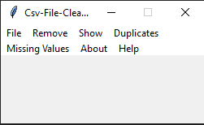

# Csv-File-Cleaner

 

# Table of contents

<!--ts-->
  * [Csv-File-Cleaner](#Csv_File_Cleaner)
  * [Table of contents](#Table_of_contents)
  * [Files/Folders](#Files/Folders)
  * [Dependencies](#Dependencies)
  * [Current Version](#Current_Version)
  * [Documentation](#Documentation)
  * [Radon](#Radon)
  * [Keybinds](#Keybinds)
  * [License](#License)
<!--te-->

## Files/Folders
 <ul>
  <li> doc (documentation file) </li>
  <li> images folder(images) </li>
  <li> csv_file_cleaner_v2 keybinds.txt(keybinds file) </li>
  <li> csv_file_cleaner_v2.py(the python file) </li>
 </ul>

## Dependencies

 <ul>
   <li> pandas (conda install -c anaconda pandas) </li>
   <li> second way to install pandas (pip install pandas) </li>
   <li> radon (conda install -c conda-forge radon) </li> 
   <li> second way to install radon (pip install radon) </li>
</ul>

## Current_Version

 

## Documentation

All project documentation is located in the `./doc`  folder.

## Radon

 

 

 

 

## Keybinds

 <ul>
  <li> Insert a csv file(Ctrl+O)</li>
  <li> Save file(Ctrl+S) </li>
  <li> Close file(Ctrl+F4) </li>
  <li> Exit(Alt+F4) </li>
  <li> Delete all duplicates(Ctrl+T) </li>
  <li> Delete all duplicates except first(Alt+F) </li>
  <li> Delete all duplicates except last(Alt+L) </li>
  <li> Delete all duplicates by specific column(Alt+C) </li>
  <li> Delete all duplicates except first by specific column(Ctrl+B) </li>
  <li> Delete all duplicates except last by specific column(Ctrl+L) </li>
  <li> Drop columns with missing values(Alt+M) </li>
  <li> Drops rows with missing values(Alt+N) </li>
  <li> About(Ctrl+I)</li>
  <li> Help(Ctrl+F1)</li>
</ul>

## License
[GNU GPLv3](https://choosealicense.com/licenses/gpl-3.0/)
